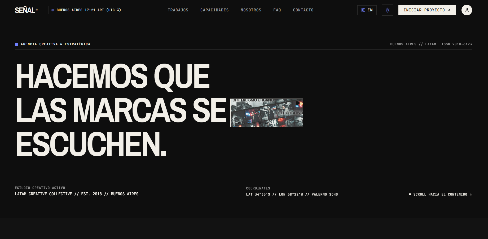

# SEÑAL®

Sitio web de una agencia creativa latinoamericana con base en Buenos Aires, con estética editorial brutalista y motion guiado por el scroll.

**Demo en vivo → [juantrezza.github.io/senal-agency](https://juantrezza.github.io/senal-agency/)**



## Qué hace

- **Casos en bento grid** con filtro por disciplina, video en hover (en dispositivos con mouse) y modal de detalle con desafío, solución, impacto, métricas y créditos.
- **Capacidades** en una lista editorial desplegable con los entregables de cada disciplina y, en desktop, una preview de imagen que sigue al cursor.
- **Showreel** integrado en el titular del hero, que abre un modal con el video completo y control de sonido.
- **Bilingüe ES/EN y tema claro/oscuro**, ambos persistidos en `localStorage`. El idioma inicial sale del navegador y el tema de `prefers-color-scheme`.
- **Relojes en vivo** de Buenos Aires en el navbar y de Madrid, Nueva York y Tokio en el footer, formateados según el idioma.
- **Métricas con contadores animados**, FAQ en acordeón y marquee de clientes.
- **Formularios** de contacto (con validación) y newsletter, sin backend: el envío es simulado y responde con un toast.
- **Accesibilidad de teclado**: skip link, modales con focus trap, cierre con Esc y foco devuelto al elemento que los abrió.

## Decisiones de diseño y técnicas

- **Lenis + GSAP en un solo loop.** Lenis no usa su propio `requestAnimationFrame`: lo mueve `gsap.ticker` y cada frame de scroll actualiza ScrollTrigger, así el scroll suave y las animaciones nunca se desfasan. Un `ResizeObserver` refresca los triggers cuando cambia el alto de la página (filtros, acordeones, fuentes). Las animaciones usan `useGSAP` (se limpian al desmontar) y `gsap.matchMedia`, así en mobile los movimientos son más cortos y no hay parallax.
- **Reveals que sobreviven al cambio de idioma.** Los títulos se revelan palabra por palabra con SplitText y máscara. El título lleva `key={lang}`: al cambiar de idioma React monta un elemento nuevo en vez de tocar nodos que SplitText ya reemplazó, el hook revierte el split anterior y parte el texto nuevo sin volver a animarlo si ya se había revelado.
- **Navegación y modales.** Los links internos pasan por `scrollToId`, que usa Lenis con el offset del header fijo (o scroll nativo si Lenis no está activo). Un hook con contador (`useLenisLock`) pausa Lenis mientras hay un modal o el menú mobile abiertos, y `data-lenis-prevent` deja scrollear su contenido interno.
- **Marquee continuo y reactivo.** El marquee de clientes lo mueve GSAP en loop, y su velocidad y dirección siguen a la velocidad del scroll: se acelera al scrollear, se invierte al subir y frena suave con el mouse encima.
- **Motion sin re-renders.** La preview de Capacidades sigue al cursor con `gsap.quickTo` sobre un `ref`, sin `setState` por movimiento. Los contadores de Métricas solo actualizan el estado cuando cambia el entero, así React sigue formateando el número según el idioma.
- **Reduced-motion.** Con `prefers-reduced-motion` no se inicializa Lenis, no se crean animaciones de scroll ni reveals, el marquee queda quieto, los contadores muestran el valor final y se anulan las transiciones CSS.
- **Sin librerías de estado.** Tema, idioma y relojes viven en hooks y un context propios (`useTheme`, `LanguageProvider`, `useBuenosAiresTime`); el contenido es estático y bilingüe en `src/i18n/`, así el sitio se despliega como estático en GitHub Pages.

## Stack

React 19 + TypeScript · Vite · Tailwind CSS 3 (+ tailwindcss-animate) · GSAP (ScrollTrigger, SplitText) + Lenis · lucide-react · GitHub Actions → GitHub Pages

## Correrlo localmente

```bash
git clone https://github.com/JuanTrezza/senal-agency.git
cd senal-agency
npm install
npm run dev   # http://localhost:3000/senal-agency/
```

## Estructura

```
src/
├── components/   # secciones, navbar, footer, modales y toast
├── hooks/        # tema, relojes, focus trap, scroll y motion
├── lib/          # motion.ts (Lenis + GSAP + ScrollTrigger) y scroll.ts (navegación interna)
├── i18n/         # textos ES/EN y contexto de idioma
├── data/         # contenido estático (clientes del marquee)
└── types/
```

## Autor

**Juan Moreno Trezza** — [Portfolio](https://juantrezza.github.io/porfolio/) · [LinkedIn](https://www.linkedin.com/in/juanmorenotrezza/) · [GitHub](https://github.com/JuanTrezza)

Proyecto de portfolio: SEÑAL® es una agencia ficticia, y sus clientes, casos y métricas también lo son.
